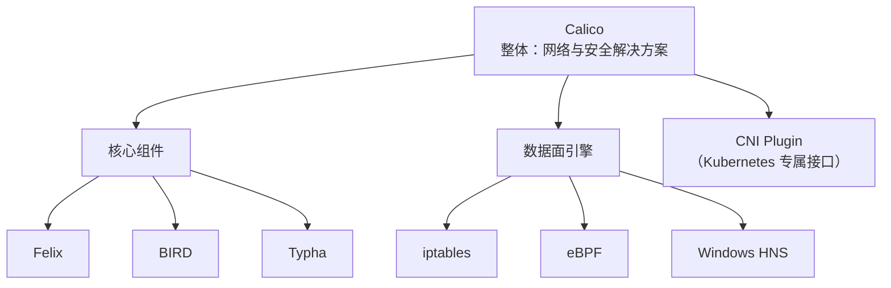

---
tags:
  - 运维
  - CNI插件/Calico
---

# 核心思想
**为每个容器分配一个可路由的IP地址，构建一个扁平(不封装数据包)的三层网络**, 让Pod之间直接通过IP路由通信，无需NAT，无需隧道，像物理服务器一样

> [!note] 
> **Flannel提供基本的网络连接，而Calico则在此基础上，提供了企业级的网络安全控制和性能优化选项**

## 扁平
- **扁平网络（Flat Network）**：在容器网络语境下，就是指**数据包在传输过程中，其原始的Pod IP地址不被改变、不被打包封装**。数据包就像在传统物理网络中一样，直接拿着Pod的源IP和目标IP，通过路由表一跳一跳地转发到目的地。这就是“扁平”的含义——网络拓扑没有多层叠加。
    
- **非扁平（Overlay网络）**：当使用VXLAN/IPIP时，数据包的原始Pod IP会被“藏”在一个外层包头里，物理网络只看到外层物理机的IP。这就像在原有道路上空架了一层高架桥，数据包需要“上桥”和“下桥”，这就是“`叠加(overlay)`”的概念。
## 二层/三层网络

> [!tip] 
> VXLAN封装二层以太帧(`二层隧道`)
> IPIP封装三层IP包(`三层隧道`)
> BGP交换和维护IP路由表(`三层路由`)
- **二层网络（数据链路层）**：核心是 **MAC地址** 和 **广播**。核心设备**物理交换机**
  - **特点**：**不能跨网段**。数据包在二层网络里靠MAC地址寻址，只要在同一个网段（比如都是`192.168.1.x/24`），就能直接通信。
  - **局限性**：数据包无法跨越路由器或三层网关

- **三层网络（网络层）**：核心是 **IP地址** 和 **路由**。核心设备是**路由器**或三层交换机
  - **过程**：当要访问一个不在自己大楼（不在同一网段）的IP时，数据包会被发送到“大门”（**网关/路由器**）。路由器会查自己的“地图”（**路由表**），来决定下一步该走哪条路。如果地图上没有目标地址的明确路径，路由器会去问邻居（**BGP协议**就是干这个的），一步步找到目标所在的大楼。
  - **关键区别**：**二层靠“广播+MAC”找本地，三层靠“路由+IP”找全局**
# Calico与Flannel性能对比
| 场景/模式                 | Flannel                                              | Calico                                                                   | 性能差异核心原因                                                                         |
| --------------------- | ---------------------------------------------------- | ------------------------------------------------------------------------ | -------------------------------------------------------------------------------- |
| **纯路由模式 (同节点/同二层网络)** | `host-gw` 模式性能接近物理网络                                 | `BGP` 模式性能同样接近物理网络                                                       | **两者基本持平，性能最佳，无封装开销。** Calico的BGP在大规模集群中动态路由管理更优                                 |
| **隧道模式 (跨子网/通用场景)**   | `VXLAN` 模式，有封装开销，带宽损耗约15-20%                         | `IPIP` 或 `VXLAN` 模式，同样有封装开销                                              | **Calico通常略优于Flannel。** Calico的IPIP协议头更小，性能损耗略低实测Calico延迟(1.6ms)优于Flannel(2.8ms) |
| **混合/高级模式**           | `VXLAN + DirectRouting`: 同网段`host-gw`直连，跨网段 VXLAN 隧道 | **CrossSubnet模式**：同网段走BGP路由，跨网段自动切隧道，兼顾性能与灵活性。**eBPF模式**：可进一步降低延迟，提升转发性能 | 性能非常接近，但**Calico凭借网络策略和eBPF模式，在复杂场景下优势更明显。**                                     |

# 网络模式(Network Modes)
| 模式名称                   | 核心机制                                            | 适用网络环境                                   | 性能                             | 运维复杂度                          |
| ---------------------- | ----------------------------------------------- | ---------------------------------------- | ------------------------------ | ------------------------------ |
| **[[BGP模式]](纯路由)**        | 节点通过BGP协议直接交换路由，数据包完全不封装，直接通过物理网卡转发。            | **所有节点都在同一个二层网络**，且物理交换机/路由器愿意学习Pod网段路由。 | **最高**（接近物理网络延迟，CPU开销最低）       | **较复杂**（需要配置BGP邻居，可能需调整物理网络设备） |
| **IPIP/VXLAN模式 (全隧道)** | 所有跨节点通信都强制进行IPIP或VXLAN封装，每个数据包都套上外层包头。          | **任意网络环境**，对底层网络几乎无要求（只要节点间IP能通即可）。      | **较差**（有封装/解封装开销，CPU消耗较高）      | **最简单**（开箱即用，无需网络管理员配合）        |
| **CrossSubnet模式 (混合)** | **智能选择**：节点同网段时走BGP纯路由；节点跨网段时自动切换为IPIP/VXLAN隧道。 | **节点分布在多个子网**的混合环境，这是最实际、最常见的生产场景。       | **均衡**（大部分同网段流量高性能，少量跨网段流量走隧道） | **中等**（配置比全隧道稍复杂，但通常只需指定网段信息）  |

# 数据面引擎(Data Plane)
| 对比维度     | **iptables**                 | **eBPF**                            |
| -------- | ---------------------------- | ----------------------------------- |
| **工作方式** | **线性查表**。拿着清单逐条核对，规则越多，检查越慢。 | **智能匹配**。把清单编译成高效的哈希表，可以直接定位规则，速度快。 |
| **检查速度** | 规则数量大时（比如几千条），**延迟显著增加**。    | 规则数量对性能影响很小，**延迟低且稳定**。             |
| **资源消耗** | 在节点上动态生成大量规则，配置更新时可能消耗高CPU。  | 程序直接挂载在内核路径，资源开销更小。                 |
| **可观测性** | 调试困难，只能看到计数，难以追踪具体丢包原因。      | 提供丰富的**可观测性指标**，可以精确看到哪个策略命中、丢包原因等。 |
| **适用版本** | 传统模式，几乎所有内核版本都支持。            | **需要Linux内核版本 >= 5.10**，对节点系统有要求。   |

# 核心组件

|组件|角色定位|核心职责|
|---|---|---|
|**Felix**|**节点上的"大脑"与"执行者"**|运行在每个节点上的核心代理。负责编程路由（写入Linux内核FIB）、编写ACL规则（实现网络策略）、管理虚拟网卡接口|
|**BIRD**(BGP模式)|**路由信息的"外交官"**|在每个节点上运行的BGP客户端。负责将Felix设置的路由信息，通过BGP协议广播给集群中的其他节点，让网络认识新Pod的路由|
|**Confd**|**配置的"监听者"与"转换器"**|轻量级的配置管理工具。监控数据存储（如etcd）中BGP等配置的变化，动态生成BIRD的配置文件并触发其重载。|
|**Calico CNI Plugin**|**Pod网络的"接线员"**|符合CNI标准的插件，在Pod创建时负责网络配置：分配IP地址、设置网络命名空间、将网络策略和路由应用到Pod。|
|**Typha (可选)**|**大规模集群的"消息中转站"**|在大规模集群中，作为Felix和Kubernetes API之间的缓冲，聚合事件并降低API Server的压力。|
|**calicoctl**|**管理员手中的"指挥棒"**|Calico的命令行管理工具，用于查看、配置和管理Calico网络资源。|
|**BGP Route Reflector (可选)**(BGP模式)|**BGP网络的"交通调度中心"**|在大规模集群中（通常>100节点），为避免全互联模式（N²连接）的性能问题，使用路由反射器作为中心节点来分发路由信息|